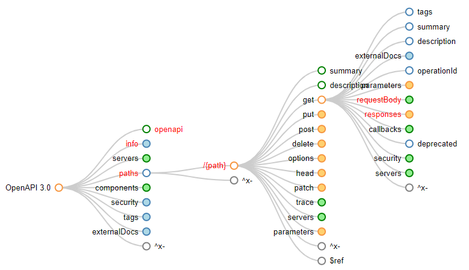

# Documenting an API

## 12.1 Creating reference documentation

It is important to create thorough reference documentation, ideally using the OpenAPI specification, and display that information through a user interface like [Swagger UI](https://swagger.io/tools/swagger-ui/) or [ReDoc](https://github.com/Rebilly/ReDoc). Lauret provides examples in ReDoc for this chapter.

Most of this section is a review of the OpenAPI specification and how you should document certain things. For example, you should provide an appropriate, but not redundant, description for each property.

[OpenAPIMap](https://openapi-map.apihandyman.io) is a website created by Lauret that performs as a "mind map" of the OpenAPI specification. Clicking on the "OpenAPI 3.0" node (using the Version 3.0 tool) will show all the possible child items for that property, with required fields highlighted in red, and you can continue to click on nodes to drill down further into the specification.

For example, in the diagram below, you can see that the root requires an `openapi`, `info`, and `paths` property. The `paths` property requires at least one `/{path}` property. The `/{path}` properties do not have any requirements, but if you added a `get` property, you would need to at minimum provide a `requestBody` property and a `responses` property. However, opening up the `requestBody` property and reading the description, we can see that "[t]he requestBody is only supported in HTTP methods where the HTTP 1.1 specification RFC7231 has explicitly defined semantics for request bodies." (Lauret, 2019).



Using the map, we can generate a simple OpenAPI specification.

```yaml
openapi: "3.0.0" # required
info: # opening up the `info` node, we can see that a title and version are required
    title: "Example specification"
    version: "1.0.0" # must be a string so the semantic version is preserved
paths:
    /example: # /{path}
        get: # the http verb
            responses: # required
                200: # the status code
                  description: "A successful request" # a description
```

If you aren't fully-convinced that your OpenAPI specification is up to snuff, then you can download one of the many linting extensions available, or throw it into the Swagger Editor at <https://editor.swagger.io> to verify your formatting.

Or, if you're more of a text-driven individual, you can read the full specification at any time via the [OpenAPI-Specification project on GitHub](https://github.com/OAI/OpenAPI-Specification) or at <https://spec.openapis.org/oas/latest.html>.

Descriptions are often incredibly helpful when utilizing a specification, but "[t]here is no need for 'Captain Obvious' descriptions like '`amount`: the transfer's amount' or, even worse, '`amount`: the amount" (Lauret, 2019). It is important to add descriptions, but only when they truly add value to the specification.

It is also important to add examples for each of your endpoints, as Lauret says, "[examples are] a must have!" (Lauret, 2019). 

## 12.1.5 Generating documentation from the implementation: pros and cons

While there are many tools for auto-generating the OpenAPI specification from the code itself, most notably for our group, the [Swashbuckle](https://docs.microsoft.com/en-us/aspnet/core/tutorials/getting-started-with-swashbuckle?view=aspnetcore-5.0&tabs=visual-studio) or [NSwag](https://docs.microsoft.com/en-us/aspnet/core/tutorials/getting-started-with-nswag?view=aspnetcore-5.0&tabs=visual-studio) libraries for ASP.NET Core. Using tools like this will allow you easily view and manually test your API with a simple web page.

However, this isn't a silver bullet solution, and Lauret outlines several cons to this methodology of specification creation.

- The documentation created automatically is generally lacking in several areas.
- Annotation libraries, like Swashbuckle and NSwag, allow for far less flexibility than working directly with an OpenAPI document.
- By including the documentation in the code, you are implying that when the code changes, the annotations and documentation changes. However, this responsibility may not always fall on the developers, and could lead to documentation becoming out of sync with changes and force non-developers to work with source code, which may be out of their comfort zone. This is especially dangerous if a commit to your code publishes your application automatically; the documentation and code could (hopefully temporarily) become out of sync in dangerous ways.
- In order to actually generate the documentation, code is required to be written. This means that the specification becomes closely married to the implementation, which is generally undesirable for a good API.

## 12.2 Creating a user guide

"Complete reference documentation listings and describing every component of an API is a must-have," (Lauret, 2019) but is is not the only thing that a well-documented API requires. You should also provide in-depth examples and how-tos for common scenarios that are easily consumable by developers and users alike.

These descriptions can be embedded directly in the OpenAPI specification using Markdown and [literal blocks](https://yaml.org/spec/1.2.1/#style/block/literal) like below. You can still create these examples separately, but it is important that you add appropriate links and information to make these examples easily discoverable and "linked" to the specification itself.

```yaml
description: |
    By adding the `|` (bar) after the property name, you trigger a
    literal block. This will allow you to use *Markdown* within
    the description. 
```

It is also helpful to provide pictures and diagrams, and Laurent recommends the PlantUML library if you "struggle with drawing tools" (Lauret, 2019). You can download the library at <https://plantuml.com>.

### 12.2.2 Documenting security

According to Lauret, "[a]n API user guide _must_ include advice about how to register as a developer, register a consumer app, and get tokens using the available OAuth flows or whatever other security system/framework is in use" (Lauret, 2019). This is often documentation that can be written once and copy-pasted as needed. However, it is likely better to create a centralized documentation for your authorization server and provide a link to that documentation instead of duplicating "code" and leaving room for misinformation if your authentication flow changes and you forget to update _all_ of the dependent documentation.

## 12.3 Providing adequate information to implementers

It is not only important to provide the interface/contract to consumers, but it is also beneficial to provide a description of how the goals are met behind the scenes for the producers themselves. There are often a number of business rules that developers can be unaware of when implementing the API, and that can lead to faults in the output.

To facilitate "hidden" requirements that are not necessarily relevant to the consumers, the OpenAPI specification allows documentation to define `x-` properties. However, the specification will not parse these objects, they are not well-defined and can be customized and interpreted as needed.

Importantly, Lauret notes that "[t]he consumer-facing documentation must not show the `x-implementation` information; it must be stripped from the OpenAPI Specification file before it's published to the developer portal." (Lauret, 2019). While it is important to document the internal requirements, it is equally important to not expose those inner-workings to the consumers.

## 12.4 Documenting evolutions and retirement

The API designers should also be responsible for maintaining a changelog, since they are the ones who should know what changed and when. This document should be updated each time the API is updated, and should be easily accessible. Lauret utilizes Markdown and ReDoc to create the changelog and have it be as close as possible to the actual specification. 

> A change log should state which elements (data model properties, parameters, responses, security scopes) have been added, modified, deprecated, or retired.

*Lauret, A. (2019). Documenting an API. In The design of web apis (pp. 331–331). Manning Publications Co.*

Beyond just a simple changelog, you can also mark elements as deprecated by setting the element's `deprecated` flag to true.

```yaml
/example:
    get:
        description: "Deprecating a /path verb"
        deprecated: true # mark this method as deprecated
/property-example:
    get:
        description: "Deprecating a parameter"
        parameters:
            - name: "Still relevant"
              description: "this is not deprecated"
              schema:
                type: string
            - name: "Not relevant"
              description: "this is deprecated"
              deprecated: true # mark this property as deprecated
              schema:
                type: string
```

You can utilize the description fields of the deprecated elements to define why it is being deprecated and what element(s) to utilize instead (if any), or you could utilize an `x-` property to document the changes.

Finally, there is the [`Sunset` HTTP Header](https://datatracker.ietf.org/doc/html/rfc8594) which "indicates that a URI is likely to become unresponsive at a specified point in the future."

*Wilde, E. “RFC8594.” IETF Datatracker, Internet Engineering Task Force (IETF), May 2019, datatracker.ietf.org/doc/html/rfc8594.*

## Summary

> - API designers must participate in the creation of different types of API documentation.
> - A detailed reference documentation is a good thing, but it is not enough. We must also create a user's guide.
> - User guides must provide all needed information to use the API as a whole, including how to obtain credentials and tokens.
> - Leveraging an API description language such as the OpenAPI Specification can be of great help when creating documentation.
> - It is important to keep track of modifications in order to inform users of changes.
> - Creating documentation helps to test the API design.

*Lauret, A. (2019). Documenting an API. In The design of web apis (pp. 333–333). Manning Publications Co.*

## Discussion - September 21, 2021

- We discussed the use of documentation-generation beyond Swashbuckle, like Graham's experience with [Sandcastle](https://en.wikipedia.org/wiki/Sandcastle_(software)) and Mike and Lyn's experience with [DocFx](https://dotnet.github.io/docfx/index.html).
- Bryan also mentioned that Swagger provides a code-generation software [Sagger Codegen](https://github.com/swagger-api/swagger-codegen) which supports ASP.NET and .NET Core 2.0+
- When the section addressing implementer documentation and the `x-` property prefix, there was some confusion on how best to implement documentation for a developer vs documentation for a consumer. How do you write a single document and ensure that there is no information leakage when that document is published to the "consumer" view. Lauret mentions that you should strip all the `x-` properties out but this seems dangerous and not directly supported by the OpenAPI spec.
- A similar discussion occurred when Graham asked about how to write an OpenAPI document that supports multiple languages, for example both English and French. Unfortunately, there isn't a well-supported way to maintain a single document, and for the time being it may be required to maintain multiple API specs for multiple languages, or just accept that the specification is written in English.
- The previous two concerns could be potentially addressed in a coming version of the OpenAPI specification according to [this issue opened on May 12, 2021](https://github.com/OAI/OpenAPI-Specification/issues/2572). That would include the ability to create "override" or "overlay" documents that you can create allowing you to "copy" a base specification and replace some properties and attributes as you see fit, similar to a Resource file in .NET.
